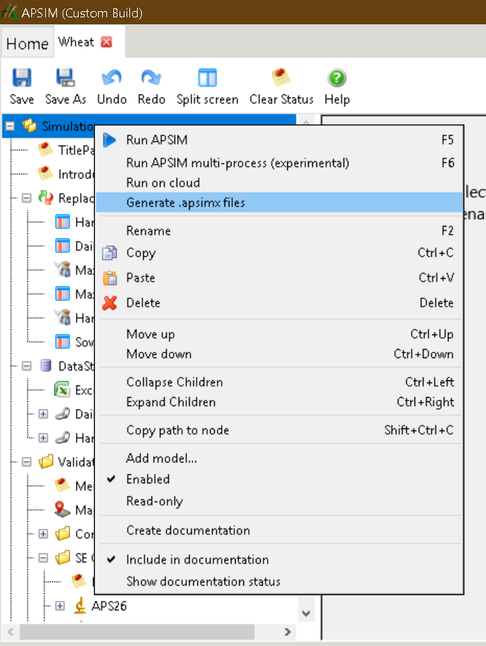

```{r, include = FALSE}
knitr::opts_chunk$set(
  collapse = TRUE,
  comment = "#>"
)
library(knitr)
```


Optimization of parameter values in the crop model is the key step to utilise models to simulate the field experiments. However, it is time consuming to calibrate lots of cultivars using observations from multiple experiments.

In this page, I presented a method using factorial simulations to calibrate and validate the leaf appearance process for wheat validation set in the [APSIM Next Generation](https://github.com/APSIMInitiative/ApsimX/). All 77 cultivars are simultaneously calibrated and validated in this process. The  method heavily depends on the available CPU resources and infrastructure of cluster which might not be suitable for every situation. The codes in this page might not be reproducible. 


The method of factorial simulations can be separated into multiple steps including

* Split apsimx into individual simulations for each treatment except cultivar factor.
* Generate parameter spaces and prepare task list for parallel calculation.
* Run tasks using cluster to obtain simulated values for factorial simulations.
* Merge simulated values of all treatments for the target cultivars.
* Calibrate and validate the leaf appearance process through comparing simulated and observed values.


```{r setup}
# Load the required packages
library(rapsimng)
suppressPackageStartupMessages(library(tidyverse))
```


## Split apsimx into individual simulations

Multiple experiments are used to test a crop model and organise into an apsimx file. It takes very long time to run a single apsimx file with lots of simulations (e.g. wheat.apsimx in the release contains more than 4000 simulations and takes more than 20 min to run all simulations). As we will run simulations in the parallel using multiple cores, the best practice is to split apsimx files into individual simulations.

The cultivars will be replaced with virtual cultivars (i.e. new values in the parameter spaces). The real cultivars in the experiment can be ignored. Consequently, we only need to run simulations for all treatments except cultivars.  


In this step, I assume all datasets have been configured in a single apsimx file (e.g. [Wheat.apsimx](https://raw.githubusercontent.com/APSIMInitiative/ApsimX/2a82f22208e1a9bd3d25b501457b43e507411b65/Tests/Validation/Wheat/Wheat.apsimx) in the APSIM NG Release). Experiments contain a factor Cv or Cultivar to specify all cultivars in the field experiments. All files are downloaded from internet. 


The input is the wheatp.apsimx and associated weather files. The output is the split apsimx files merged with weather files and stored as Rds format. 

APSIM NG provides a feature to generate .apsimx files from a single .apsim file through right clicking the root node. 

```{r apsimng-generate, out.width="40%", echo=FALSE, fig.align='center'}

```

```{r spit-apsimx, eval=FALSE}
# Path to wheat.apsimx file
file <- "Tests/Validation/Wheat/Wheat.apsimx"
# Path to store the individual apsimx files
out <- "Simulations/"
# Factor in apsimx to specify cultivars
cultivar_factor <- c("Cv", "Cultivar")

# read apsimx file
apsimx_model <- read_apsimx(file)

# Create a template
apsimx_model_temp <- apsimx_model
# Remove unused models to save spaces
remove_nodes <- c("[Simulations].Sensibility",
                  "[Simulations].Validation",
                  "[Simulations].TitlePage",
                  "[Simulations].Introduction",
                  "[DataStore].ExcelMultiInput",
                  "[DataStore].DailyObsPred",
                  "[DataStore].HarvestObsPred")
for (j in seq(along = remove_nodes)) {
  node_remove <- search_path(apsimx_model_temp, remove_nodes[j])
  if (length(node_remove) > 0) {
    apsimx_model_temp <- remove_model(apsimx_model_temp, node_remove$path)
  }
}

# Get all simulations
sims <- search_node(apsimx_model, all = TRUE, `$type` = "Models.Core.Simulation, Models")
sims <- sims %>% discard(function(x) x$node$Name == "CO2TEBaseSimulation")
print(map_chr(sims, function(x) x$node$Name))

# Process each simulation by splitting into individual treatment if parent is Experiment or directly exporting in case of single simulation.
for (j in seq(along = sims)) {
  # Check whether the parent is experiment
  parent <- get_parent(apsimx_model, sims[[j]]$path)
  if (parent$node$`$type` == "Models.Factorial.Experiment, Models") {
    exp_node <- parent$node
    exp_name <- exp_node$Name
    # Remove all figures as we don't need them
    graphs <- search_node(exp_node, all = TRUE, 
                          `$type` = "Models.Graph, Models")
    for (k in rev(seq(along = graphs))) {
      exp_node <- remove_model(exp_node, graphs[[k]]$path)
    }
    # Remove unused reports
    remove_nodes <- c("[DailyReport]",
                      "[MaxLeafSizeReport]",
                      "[SowingReport]")
    for (k in seq(along = remove_nodes)) {
      node_remove <- search_path(exp_node, remove_nodes[k])
      if (length(node_remove) > 0) {
        exp_node <- remove_model(exp_node, node_remove$path)
      }
    }
    # Create a new apsimx file from template
    apsimx_model_exp <- apsimx_model_temp
    apsimx_model_exp <- insert_model(apsimx_model_exp, c(1), exp_node)
    # Get the met files
    met <- NULL
    met_file <- NULL
    tryCatch({
      met_file <- get_metfile(apsimx_model_exp)
      met_path <- file.path(dirname(file), met_file)
      met <- readLines(met_path)
    }, error = function(e){
      
    })
    # Further split apsimx by all factors except Cv
    all_nodes <- apsimx_model_exp %>% 
      search_path("[Factors]")
    
    # find out all combinations of all other nodes
    simulations <- get_simulations(all_nodes$node)
    
    # Check whether Cv node exists
    pos <- names(simulations) %in% cultivar_factor
    if (sum(pos) == 0) {
      warning("Cultivar factor doesn't exist for experiment ", exp_name)
      #next()
    }
    # Generate all simulations for factors except cultivar
    simulations <- simulations[!(names(simulations) %in% cultivar_factor)]
    simulations <- expand.grid(simulations, stringsAsFactors = FALSE)
    # Generate apsimx for each factor
    for (m in seq_len(max(1, nrow(simulations)))) {
      # In case of single simulation
      if (nrow(simulations) == 0) {
        model_factor_new <- all_nodes$node
        base_name <- exp_name
      } else {
        # Keep the required factor
        model_factor_new <- keep_simulations(all_nodes$node, as.list(simulations[m,,drop=FALSE]))
        factor_name <- paste(paste0(names(simulations), "_", simulations[m,]), collapse = '_')
        base_name <- paste0(exp_name, "-", factor_name)
      }
      # Generate a new apsimx
      apsimx_model_new <- apsimx_model_exp
      apsimx_model_new <- replace_model(apsimx_model_exp, 
                                        all_nodes$path,
                                        model_factor_new)
      
      # Combine weather and met file
      #apsimx <- readLines(file_name)
      file_name <- file.path(out, paste0(base_name, ".Rds"))
      # Find the weather file
      if (is.null(met)) {
        treat_node <- search_path(apsimx_model_new, "[Permutation].Treat")
        if (length(treat_node) > 0) {
          if (length(treat_node$node$Children) > 1 ){
            stop()
          }
          if (length(treat_node$node$Children[[1]]$Children) > 0) {
            met_file <- treat_node$node$Children[[1]]$Children[[1]]$FileName
            met_path <- file.path(dirname(file), met_file)
            new_met <- readLines(met_path)
          } else {
            new_met <- NULL
          }
        }
      } else {
        new_met <- met
      }
      # Save weather and apsimx file into Rds format
      saveRDS(list(met = new_met, apsimx = apsimx_model_new, met_file = met_file), file = file_name)
    }
  } else {
    # In case of single simulation
    apsimx_model_new <- apsimx_model_temp
    apsimx_model_new <- insert_model(apsimx_model_new, c(1), sims[[j]]$node)
    
    # Get weather data
    met <- NULL
    met_file <- NULL
    tryCatch({
      met_file <- get_metfile(apsimx_model_new)
      met_path <- file.path(dirname(file), met_file)
      met <- readLines(met_path)
    }, error = function(e){
      
    })
    
    # Save weather and apsimx file into Rds format
    base_name <- sims[[j]]$node$Name
    file_name <- file.path(out, paste0(base_name, ".Rds"))
    saveRDS(list(met = met, apsimx = apsimx_model_new, met_file = met_file), file = file_name)
    
  }
}

```

Finally wheat.apsimx is split into 885 treatments.  

## Generate the parameter spaces and prepare the task list for parallel calculation

In this page, we will optimize two parameters in the leaf appearance rate i.e. base phyllochron (`[Phenology].Phyllochron.BasePhyllochron.FixedValue`) and photoperiod effect (`[Phenology].Phyllochron.PhotoPeriodEffect.XYPairs.Y`). The parameter range is determined by expert experience or possible values in the current wheat model. The internal should make sure there are enough accuracy for the target traits. 

```{r parameter-space}
# Define list of parameter with specified range and interval
# Expand grid for all combinations
parameters <- list(`[Phenology].Phyllochron.BasePhyllochron.FixedValue` = as.character(seq(60, 130, by = 1)),
          `[Phenology].Phyllochron.PhotoPeriodEffect.XYPairs.Y` = paste0(seq(1, 2, by = 0.02), ",1,1")) %>% 
    expand.grid()
```

A single simulation takes less than 1 s to run in the APSIM GUI (APSIMNG.exe), but about 5 s in the command lines (Modeles.exe) as the overhead to load all required libraries. It would be much more efficient to combine multiple simulations in a single apsimx file (e.g. 200 simulations take about 150 s). 

```{r parameter-into-task}
# Define the group size in a single apsimx file
size <- 200

# Calculate the number of groups
group <- seq(1, ceiling(nrow(parameters)/size))

# Create names for each virtual cultivar
# Assign the group value
parameters <- parameters %>% 
  mutate(name = paste0("GS", seq_len(n()), "GN"),
         group = rep(group, each = size , 
                      length.out = n())) %>% 
  pivot_longer(cols = starts_with("["), names_to = "parameter") 

# The parameters can be stored for later use, but ignore for this post
# saveRDS(parameters, file = "parameters.Rds)
knitr::kable(head(parameters), caption = "Sample of parameters")
```


## Run all tasks in cluster to collect results


This step is time-consuming and depends on the available CPUs. The total runtime can be calculated by number of treatments x number of virtual genotype groups x runtime of individual task / available CPUs. I used HTCondor deployed in CSIRO in which there are more 10, 000 available cores, but can normally utilize 5, 000 cores.


```{r results='asis', echo=FALSE}
# htmltools::tags$script(src = "https://code.jquery.com/jquery-3.2.1.min.js")
# htmltools::tags$link(
#   rel="stylesheet",
#   href="https://maxcdn.bootstrapcdn.com/bootstrap/4.0.0/css/bootstrap.min.css",
#   integrity="sha384-Gn5384xqQ1aoWXA+058RXPxPg6fy4IWvTNh0E263XmFcJlSAwiGgFAW/dAiS6JXm",
#   crossorigin="anonymous")
# 
# htmltools::tags$script(
#   src="https://cdnjs.cloudflare.com/ajax/libs/popper.js/1.12.9/umd/popper.min.js",
#   integrity="sha384-ApNbgh9B+Y1QKtv3Rn7W3mgPxhU9K/ScQsAP7hUibX39j7fakFPskvXusvfa0b4Q",
#   crossorigin="anonymous")
# htmltools::tags$script(
# src="https://maxcdn.bootstrapcdn.com/bootstrap/4.0.0/js/bootstrap.min.js",
# integrity="sha384-JZR6Spejh4U02d8jOt6vLEHfe/JQGiRRSQQxSfFWpi1MquVdAyjUar5+76PVCmYl",
# crossorigin="anonymous")
```


```{=html}

<div class="input-group input-group-sm mb-3">
  <div class="input-group-prepend col-5">
    <span class="input-group-text col-12">Number of treatments</span>
  </div>
  <input name="total-run-time" type="text" id="treatments" value=885 class="form-control" aria-label="Small" aria-describedby="inputGroup-sizing-sm">
</div>
<div class="input-group input-group-sm mb-3">
  <div class="input-group-prepend col-5">
    <span class="input-group-text col-12">Number of genotype groups</span>
  </div>
  <input name="total-run-time" type="text" id="genotype-groups" value=37 class="form-control" aria-label="Small" aria-describedby="inputGroup-sizing-sm">
</div>
<div class="input-group input-group-sm mb-3">
  <div class="input-group-prepend col-5">
    <span class="input-group-text col-12">Runtime of individual task</span>
  </div>
  <input name="total-run-time" type="text" id="runtime-individual" value=150 class="form-control" aria-label="Small" aria-describedby="inputGroup-sizing-sm">
  <div class="input-group-append">
    <span class="input-group-text">seconds</span>
  </div>
</div>
<div class="input-group input-group-sm mb-3">
  <div class="input-group-prepend col-5">
    <span class="input-group-text col-12">Available CPUs</span>
  </div>
  <input name="total-run-time" type="text" id="cpus" value=5000 class="form-control" aria-label="Small" aria-describedby="inputGroup-sizing-sm">
</div>
<div class="input-group input-group-sm mb-3">
  <div class="input-group-prepend col-5">
    <span class="input-group-text col-12">Total runtime</span>
  </div>
  <input name="total-run-time" type="text" id="final-runtime" class="form-control" aria-label="Small" disabled aria-describedby="inputGroup-sizing-sm">
   <div class="input-group-append">
    <span class="input-group-text">hours</span>
  </div>
</div>

```


```{js cal-runtime, class.source = "jsvis1", echo=FALSE}
$( document ).ready(function() {
  var cal_runtime = function() {
    let n_treatments = parseFloat($("#treatments").val());
    let n_genotype_group = parseFloat($("#genotype-groups").val());
    let individual_runtime = parseFloat($("#runtime-individual").val());
    let n_cpus = parseFloat($("#cpus").val());
    let final_runtime = n_treatments * n_genotype_group * individual_runtime / n_cpus / 3600;
    $("#final-runtime").val(final_runtime);
  }
  cal_runtime();
  $("input[name='total-run-time']").change(function() {
      cal_runtime();
  });
});
```
### Develop scripts to run individual task

## Merge all results for each individual experiment

## Merge all results for each individual genotype

## Optimize the genotypic parameters for each genotype


